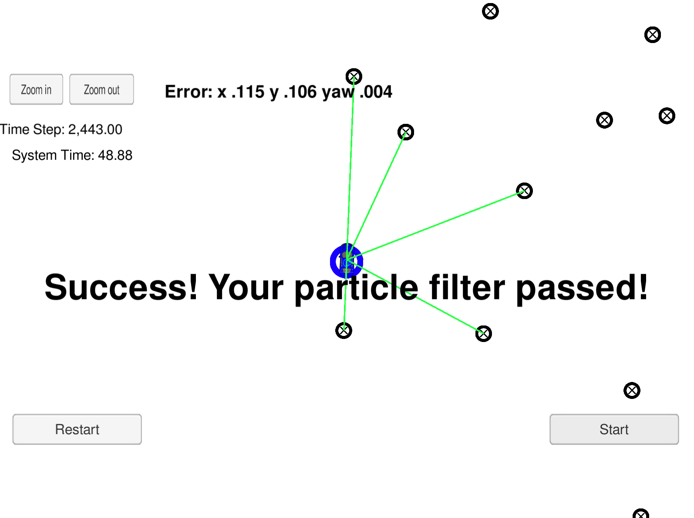

# **Kidnapped Vehicle Project - Localization using Particle Filter**
Udacity self-driving car nanodegree localization project
---
## Overview
A robot has been kidnapped and transported to a new location! Luckily it has a map of this location, a (noisy) GPS estimate of its initial location, and lots of (noisy) sensor and control data. In this project I implemented a 2 dimensional particle filter in C++. The particle filter was given a map and some initial localization information (analogous to what a GPS would provide). At each time step, the gets observation and control data.

 Input and Output variables are listed below. Inputs to the particle filter can be found in the `data` directory.

| **INPUT** | Definition |
|:---------:|:---------:|
| sense_x | x position |
| sense_y | y position |
| sense_theta | Measured heading (yaw) angle |
| previous_velocity | Previous velocity |
| previous_yawrate | Previous yaw rate|
| sense_observations_x | Noisy observation data of x positionfrom the simulator|
| sense_observations_h | Noisy observation data of y positionfrom the simulator|

| **OUTPUT** | Definition |
|:---------:|:---------:|
| best_particle_x | Best particle value for position x |
| best_particle_y | Best particle value for position y |
| best_particle_theta | Best particle value for yaw angle |
| best_particle_associations | Best (x,y) sensed positions ID label |
| best_particle_sense_x | List of sensed x positions |
| best_particle_sense_y | List of sensed y positions |

## Project steps

Localization (particle filter) steps in this project:

* Initialization function (estimate position from GPS data using particle filters, add random noise)
* Prediction function (predict position based on adding velocity and yaw rate to particle filters, add random noise)
* Update Weights function - Transformation of observation points to map coordinates (given in vehicle coordinates)
* Update Weights function - Association of landmarks to the transformed observation points
* Update Weights function - Calculation of multi-variate Gaussian distribution
* Resample function - Resamples particles, with replacement occurring based on weighting distributions
* Optimizing algorithm - Performance within required accuracy and speed


## Running the Code
This project involves the Term 2 Simulator which can be downloaded [here](https://github.com/udacity/self-driving-car-sim/releases). The main program can be built and ran by doing the following from the project top directory.

1. mkdir build
2. cd build
3. cmake ..
4. make
5. ./particle_filter

Alternatively some scripts have been included to streamline this process, these can be leveraged by executing the following in the top directory of the project:

1. ./clean.sh
2. ./build.sh
3. ./run.sh

## Implementing the Particle Filter
The directory structure of this repository is as follows:

```
root
|   build.sh
|   clean.sh
|   CMakeLists.txt
|   README.md
|   run.sh
|
|___data
|   |   
|   |   map_data.txt
|   
|   
|___src
    |   helper_functions.h
    |   main.cpp
    |   map.h
    |   particle_filter.cpp
    |   particle_filter.h
```

#### The Map*
`map_data.txt` includes the position of landmarks (in meters) on an arbitrary Cartesian coordinate system. Each row has three columns
1. x position
2. y position
3. landmark id

## [Rubric points](https://review.udacity.com/#!/rubrics/747/view) 

1. **Accuracy**: This criteria is checked automatically when ./run.sh is run in the terminal; the code outputs the following message which shows the success.

```
Success! Your particle filter passed!
```

The accuracy limit is defined as 1 meter in error for x and y translations, 0.05 rad in error for yaw, and 100 seconds of runtime for the particle filter. The accuracy of my code is measured by the error values as follows which are in the aforementioned limit.

| **Variable** | **Error** |
|:---------:|:---------:|
| x position | 0.115 |
| y position | 0.106 |
| yaw | 0.004 |


2. **Performance**: My particle filter completes execution within 48 seconds which is below the time limit of 100 seconds.

Here is the visualization of the code output which shows the success message, execution time and error values.




